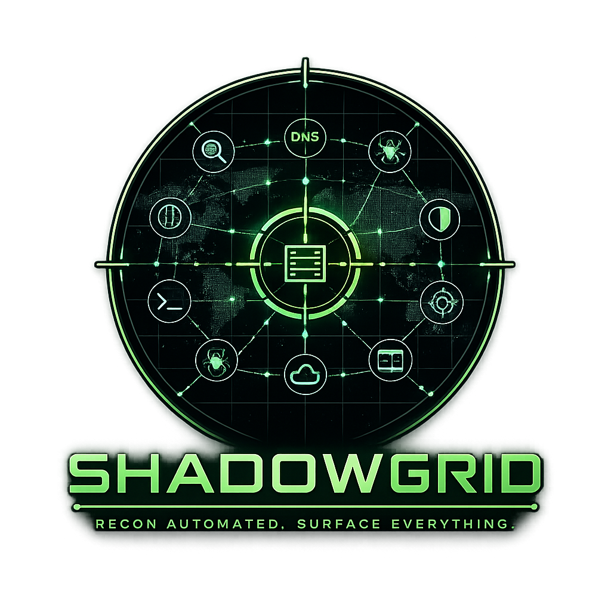

<div align="center">



# ShadowGrid

**An application-security platform — map, assess, and track the security posture of every app you own.**


</div>

---

## Overview

**ShadowGrid** is a full-stack **application-security (AppSec) platform**. It turns 20+ best-in-class open-source security tools into a single, phased, parallelised assessment pipeline behind a modern SaaS-style web app — with a posture dashboard, cross-program scan activity, and a unified findings view.

You organise work into **programs** (an application and its in-scope / out-of-scope scope), then launch **assessments** against them. Each assessment walks six deterministic phases — asset discovery, subdomain enumeration, DNS resolution, HTTP probing & port scanning, URL discovery, and vulnerability scanning / WordPress / screenshots / dorking / AI analysis — running independent tools in parallel, streaming **live progress over SSE**, and collecting every finding into one dashboard.

It's built for **security teams, penetration testers, and bug-bounty hunters** who want repeatable, resumable, trackable AppSec assessments without hand-wiring a dozen CLIs and reconciling their output by hand. (Attack-surface / asset enumeration is one phase of the pipeline — not the whole product.)

> The name says what it does: a **grid** of security probes mapping an application's exposure — everything sits in **shadow** until an assessment lights it up, with a live reticle locked on the host being probed (exactly what the logo depicts).

### Why ShadowGrid

- **A platform, not a script** — a posture **Dashboard**, a cross-program **Scan Activity** board, per-program **Assessments**, and a multi-tab findings view, all in a light/dark SaaS UI.
- **One pipeline, many tools** — subfinder, amass, httpx, naabu, nuclei, katana, wpscan, gowitness and more, coordinated so each phase hands clean artifacts to the next.
- **Phase gating** — a phase never starts until the previous one has fully drained and written its hand-off files (e.g. merged subdomains → alive hosts → alive URLs), so downstream tools always get real input.
- **Validated data** — discovered URLs are re-probed and dead links dropped before they reach results; WordPress scanning is driven off the validated alive-URL set.
- **Live & interactive** — watch every tool report in real time (grouped per domain, not stacked), and **browse, filter and sort the results table while the assessment is still running**.
- **Resumable & cancellable** — stop a run mid-flight (in-flight processes are terminated **and the cancelled assessment's data is deleted**), or resume a program and reuse prior successful results instead of re-running finished work.
- **Editable & tidy** — rename a program or edit its description after creation, and **clear all of a program's assessment history** (including cancelled runs) in one click.
- **Scope-aware** — out-of-scope patterns (incl. wildcards) are filtered at every stage, so results stay inside your authorisation.
- **Bring your own storage** — always-on local JSON/file storage, with optional mirroring to Azure Table Storage.

---

## Quick Start (Docker)

```bash
git clone https://github.com/ovawatch-sec/shadow-grid.git
cd shadow-grid

docker compose -f docker/docker-compose.yml up --build -d
```

Open **http://localhost:8080**, then:

1. **Set a password** (required on first visit) and log in.
2. Land on the **Dashboard** (security posture across all programs).
3. **Create a program** and define its **scope** (in-scope apps + any out-of-scope patterns).
4. **Select tools** and **launch an assessment** — watch grouped live progress, browse results as they stream in, then review the full findings dashboard.

---

## Web interface

A modern, SaaS-style single-page app with a light/dark theme toggle (it follows your OS preference until you choose):

- **Dashboard** — security-posture overview: programs, active assessments, completed assessments, and a recent-activity feed.
- **Programs** — create/manage application-security programs; each card shows its assessment count. Inside a program you can **edit its name/description**, define **scope**, launch a **new assessment**, review the **assessments** history, and **clear all program data** (a guarded action that removes every assessment — including cancelled ones — and their results, while keeping the program and its scope).
- **Scan Activity** — a cross-program board of running and recent assessments as clean status cards, so scanning many domains at once stays readable instead of stacking into one long list.
- **Live progress** — per-assessment view that groups tools into a card **per domain**, each with its own progress bar; cancel from here, or jump straight to the results collected **so far**.
- **Results** — multi-tab findings (subdomains, DNS, HTTP/ports, vulns, WordPress, URLs, tech, dorks, screenshots, AI). The table is fully interactive — **sort/filter/paginate while the assessment is still running**, and it refreshes in place without losing your place.

---

### Normalized inventory and change tracking

Every completed assessment now correlates raw tool output into stable assets,
observations, relationships, and findings. The **Inventory & Changes** results
tab shows the current attack surface and compares it with the preceding completed
assessment. The same data is available from:

- `GET /api/inventory/{scan-id}`
- `GET /api/inventory/{scan-id}/delta`

Each completed scan also writes a hashed `_manifest.json` beside its evidence.
Container readiness is exposed at `GET /api/ready`; authenticated request metrics
are available in Prometheus text format at `GET /api/metrics`. All of these
features are local and require no commercial account or subscription.

## First Run & Authentication

ShadowGrid uses single-password auth — no default credentials ever exist. On first visit the UI forces you to set a password; every project, scan, and settings page is locked behind login. Tokens are HMAC-signed and expire after 7 days.

**Forgot the password?** Reset it offline with the bundled script (it lives in the same Docker volume as the app data):

```bash
# Interactive prompt inside the running container
docker exec -it shadowgrid python3 /app/backend/reset_password.py

# …or via the convenience wrapper
./docker/reset-password.sh
```

By default the reset rotates the token-signing secret (logging out all sessions). Pass `--keep-sessions` to preserve existing logins. See `--help` for all options.

---

## Architecture

```
┌─────────────────────────────────────────┐
│  Browser (Angular 17, light/dark SaaS)   │
│  - Posture dashboard + scan activity     │
│  - Program / scope management + editing  │
│  - Assessment config + tool selection    │
│  - Live progress (SSE), grouped by domain│
│  - Interactive results (live while running)│
└────────────────┬─────────────────────────┘
                 │ HTTP / SSE   (nginx reverse proxy)
┌────────────────▼─────────────────────────┐
│  FastAPI Backend (Python 3.12)           │
│  - REST API: projects / scans / results  │
│      · PATCH project (edit details)      │
│      · POST project/clear (wipe history) │
│  - Async phased + parallel scan engine   │
│  - Pluggable tool abstraction layer      │
│  - Single-password auth (bearer tokens)  │
└────────────────┬─────────────────────────┘
                 │
┌────────────────▼─────────────────────────┐
│  Storage Layer                           │
│  ├─ File storage (always on)             │
│  │    projects/<project>/scans/<scan>/  │
│  │      assets/<domain>/<tool artifacts>│
│  │    output/.meta/{projects,scans,…}    │
│  └─ Azure Table Storage (optional)       │
│       shadowgrid{Projects|Targets|Scans| │
│                  Results|Config}         │
└──────────────────────────────────────────┘
```

The whole stack ships as a **single container** — Angular build, FastAPI backend, ~20 compiled Go/Ruby recon binaries, and nginx — built via a multi-stage Dockerfile.

---

## Scan Phases (parallel execution)

| Phase | Tools | Execution |
|-------|-------|-----------|
| 1 — Asset Discovery | `whois`, `asnmap` | parallel |
| 2 — Subdomain Enumeration | `crtsh`, `assetfinder`, `subfinder`, `amass`, `shuffledns` | **all parallel** |
| 3 — DNS Resolution | `dnsx`, `dns_records`, `zone_transfer` | parallel |
| 4 — HTTP, TLS & Port Validation | `httpx`, `tlsx`, `naabu` | parallel |
| 5 — URL Discovery | `waybackurls`, `gau`, `katana`, `urlfinder` | **all parallel** (URLs are re-probed; dead links dropped) |
| 6 — Vuln · Takeover · WordPress · Screenshots · Dorks · AI | `nuclei`, `subdomain_takeover`, `wpscan`, `gowitness`, `whatweb`, `google_dorks`, `ai_analysis` | parallel (AI runs last) |

Between phases, ShadowGrid writes canonical hand-off artifacts — `subdomains_merged.txt` → `resolved_subdomains.txt` / `probe_candidates.txt` → `alive_urls.txt`. Unresolved fallback candidates are never presented as alive; HTTP/TLS tools validate candidates and record explicit reachability states.

**Notes**
- **Cancel deletes data:** every assessment owns an isolated `projects/<project-id>/scans/<scan-id>/assets/` workspace. Cancelling kills in-flight processes and deletes that assessment's results, progress, and artifacts without affecting another run.
- **Clear program data:** from a program's page you can wipe **all** of its assessment history — every run including cancelled ones, and their results — while keeping the program and its scope. Any still-running assessment is terminated first.
- **Edit program details:** a program's name and description can be changed at any time after creation (`PATCH /api/projects/{id}`).
- **Resume vs. fresh:** reuse is permitted only from one completed assessment with the same scope, exclusions, selected tools, and wordlist fingerprint. Its evidence snapshot is copied into the new workspace before results are reused.
- **URL validation** — every discovered URL (waybackurls, gau, katana, urlfinder) is re-probed with httpx and any that no longer respond (dead hosts, `404`/`410` gone pages) are removed before it reaches the results. Broken/blank screenshots are likewise discarded.
- **WordPress scanning** — `wpscan` runs only against WordPress sites, but now draws its targets from **both** signals: hosts fingerprinted as WordPress (httpx tech-detection / whatweb) **and the validated alive-URL set** — any alive URL carrying a WordPress marker (`/wp-login.php`, `/wp-content/`, `/xmlrpc.php`, `/wp-json`, …) or living on a WordPress-fingerprinted host is scanned (normalised to its site root, capped per domain). It surfaces core/plugin/theme vulnerabilities, interesting findings and enumerated users in a dedicated **WordPress** results tab. Add a **WPScan API token** in Settings to query the WordPress Vulnerability Database for CVE-level results.
- **Google dorking** executes generated dorks live — via Google Programmable Search (CSE) when an API key + engine ID are saved in Settings, otherwise a DuckDuckGo fallback.
- **Subdomain takeover** hunts dangling/claimable subdomains (nuclei takeover templates, plus `subzy` when available).
- **AI analysis** summarises findings when an AI provider key (OpenAI / Anthropic / Google / DeepSeek / Groq) is configured in Settings. With more than one in-scope asset, a **separate analysis is produced per asset**.

---

## Pre-installed Tools

| Tool | Purpose |
|------|---------|
| assetfinder | Passive subdomain discovery |
| subfinder | Multi-source passive subdomain enumeration |
| amass | OWASP passive subdomain enumeration |
| shuffledns | Active DNS bruteforce (via massdns) |
| crt.sh | Certificate-transparency lookup (HTTP) |
| dnsx | DNS resolution + record lookups |
| httpx | HTTP probing + tech detection |
| tlsx | TLS and certificate inventory, including SAN relationships |
| naabu | Port scanning |
| nuclei | Template-based vulnerability scanning |
| subzy | Subdomain-takeover detection (secondary engine) |
| wpscan | WordPress vulnerability scanning (WordPress hosts only) |
| gowitness | Web screenshots |
| whatweb | Technology fingerprinting |
| waybackurls | Historical URLs from the Wayback Machine |
| gau | GetAllURLs (Wayback + CommonCrawl + OTX) |
| katana | Active web crawler |
| urlfinder | Passive URL discovery |
| asnmap | ASN + IP-range discovery |
| whois | WHOIS lookups |
| dig | DNS record queries |

> A tool that isn't installed (or is missing an API key) is cleanly **skipped** and reported in progress — it never breaks a scan.

---

## CLI Usage (no Docker required)

```bash
cd shadow-grid
pip install -r backend/requirements.txt

# Full scan
python3 recon.py -d example.com

# Passive only
python3 recon.py -d example.com --passive-only

# Specific tools
python3 recon.py -d example.com --tools crtsh,subfinder,httpx,nuclei

# Multiple targets + out-of-scope patterns
python3 recon.py -d example.com shop.example.com --oos "*.internal.example.com"

# Custom output / data directories
python3 recon.py -d example.com --output-dir ./output --data-dir ./data

# With Azure storage
python3 recon.py -d example.com --azure-conn "DefaultEndpointsProtocol=https;..."

# List all tools and their availability
python3 recon.py -d x --list-tools
```

> The CLI shares the exact same scan engine and tool layer as the web app — only the entry point differs.

---

## Docker Commands

```bash
# Build & start (detached)
docker compose -f docker/docker-compose.yml up --build -d

# Follow logs
docker logs -f shadowgrid

# Shell into the container
docker exec -it shadowgrid bash

# Stop
docker compose -f docker/docker-compose.yml down
```

---

## Azure Table Storage (optional)

1. Create an Azure Storage account.
2. In the web UI → **Settings** → enable **Azure Table Storage**.
3. Paste your connection string (or account name + key) — tables are created automatically.

Or configure it via environment in `docker/docker-compose.yml`:

```env
AZURE_STORAGE_ENABLED=true
AZURE_CONNECTION_STRING=DefaultEndpointsProtocol=https;AccountName=...
```

Local file storage is always active; Azure is mirrored on top of it.

---

## Adding a New Tool

ShadowGrid's tool layer is pluggable — adding a tool touches two files:

1. Create `backend/tools/<category>/mytool.py`.
2. Subclass `BaseTool`; set `name`, `category`, `description`, `parallel_group`.
3. Implement `run()` (invoke the binary) and `parse()` (raw output → `list[dict]`).
4. Add one line to `backend/tools/registry.py`.

That's it — the scan engine, API, and UI pick it up automatically.

---

## Project Structure

```
shadow-grid/
├── backend/            FastAPI app, scan engine, tool layer, storage, auth
│   ├── scan_engine.py      phased + parallel orchestration
│   ├── tools/              one module per security tool (+ registry.py)
│   ├── storage/            file + Azure dual storage
│   ├── tests/              pytest suite (URL validation, wpscan targets, storage, endpoints)
│   └── reset_password.py   offline password-reset utility
├── frontend/           Angular 17 SPA — dashboard, programs, scan activity,
│                       live progress, interactive results (light/dark)
├── docker/             Dockerfile, docker-compose.yml, nginx.conf, entrypoint.sh
├── data/               wordlists, resolvers and other tool data
└── recon.py            CLI entry point (same engine as the web app)
```

---

## Development & Tests

```bash
# Backend — unit tests (no network / recon binaries required)
cd backend
pip install -r requirements.txt pytest
python -m pytest tests/ -q

# Frontend — type-check + production build
cd frontend
npm ci
npx ng build
```

The backend test suite covers the pure logic behind the assessment lifecycle:
URL liveness validation, wpscan target selection (including the alive-URL
signal), scan/result deletion, and the project update/clear endpoints.

---

## Legal & Ethical Use

ShadowGrid is intended for **authorised security testing only** — your own assets, or targets you have explicit written permission to assess (e.g. an in-scope bug-bounty program or a signed engagement). Active modules (port scanning, DNS bruteforce, crawling, vulnerability templates) generate real traffic against targets. Scanning systems without authorisation may be illegal. **You are responsible for how you use this tool.**
